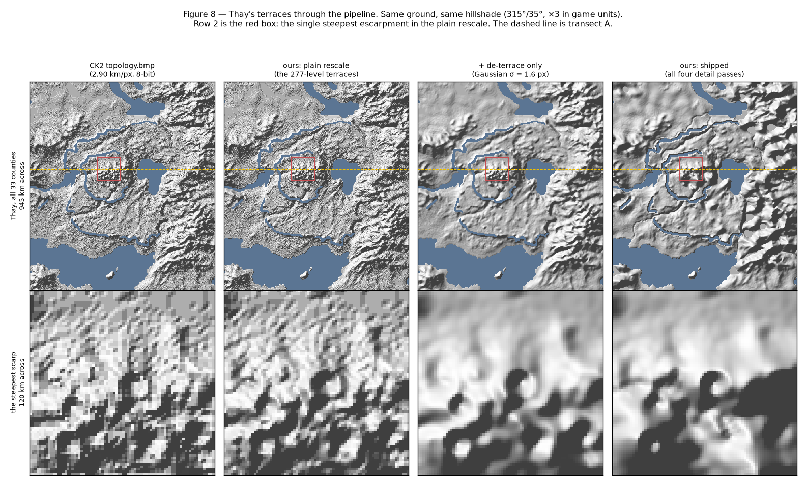
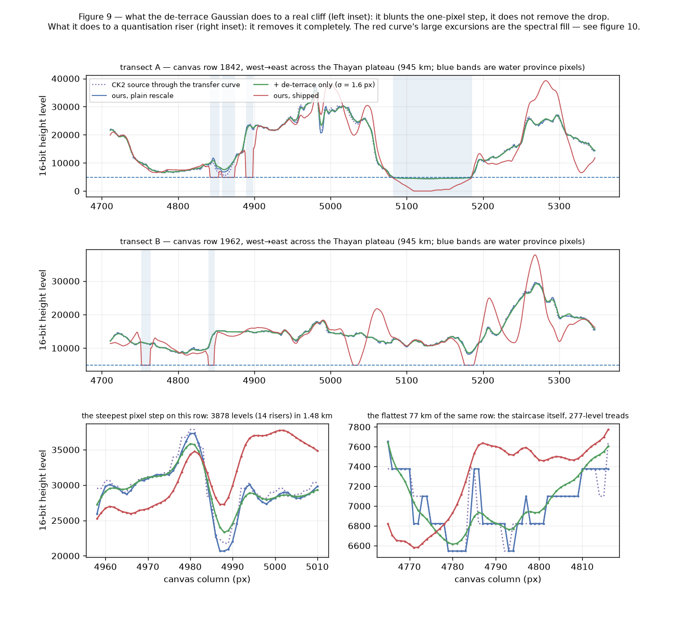
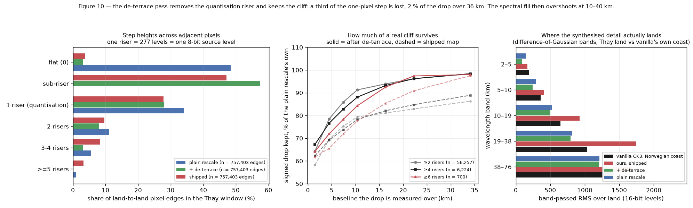
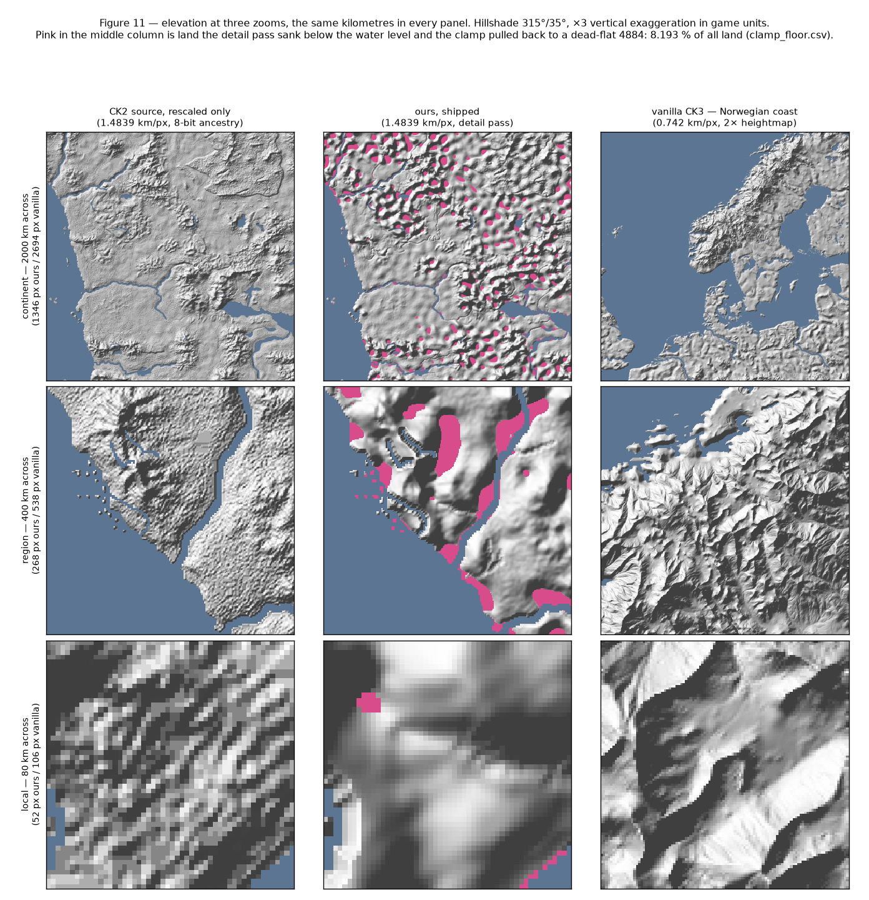
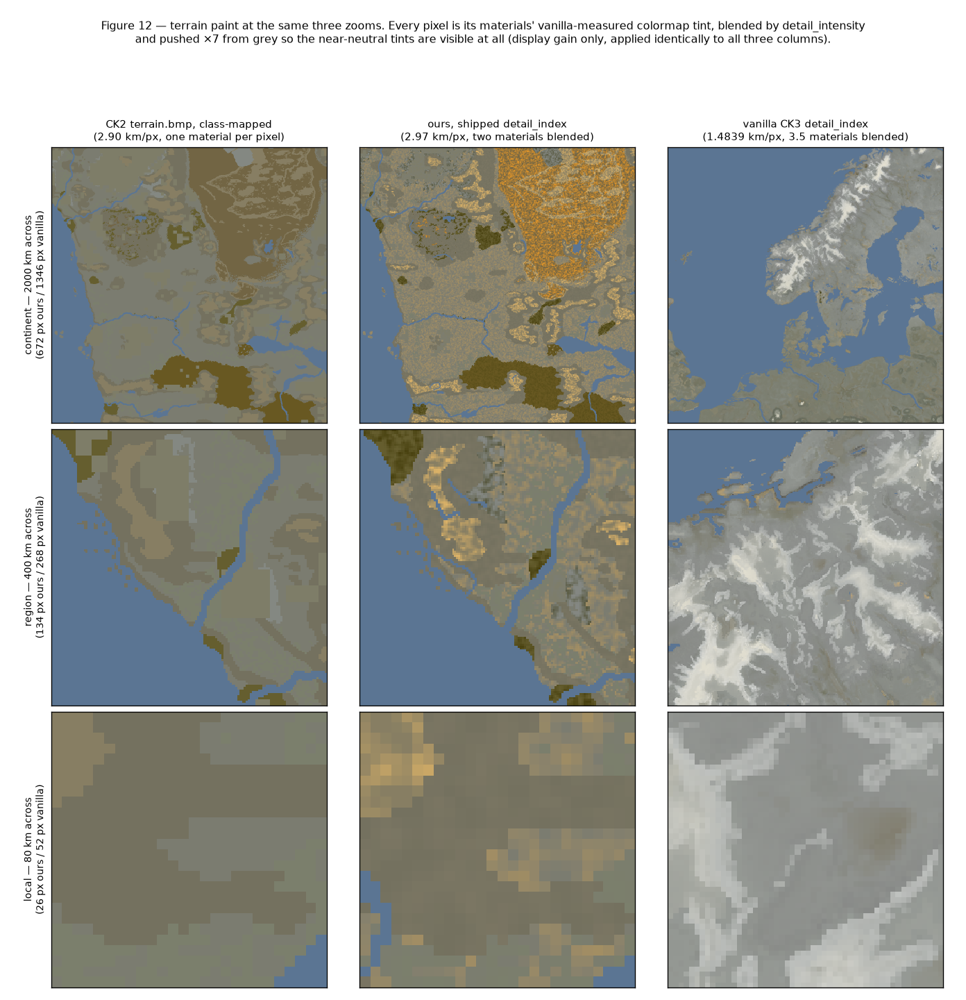
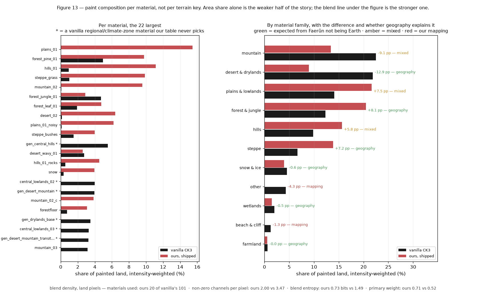

# Painting Faerûn: micro-scale similarity with vanilla, macro-scale fidelity to CK2

**Method in one paragraph.** The converter reads five CK2 bitmaps — `topology.bmp`,
`terrain.bmp`, `trees.bmp`, `rivers.bmp`, `provinces.bmp` — and writes the rasters
CK3's renderer actually samples: `map_data/heightmap.png` (through the packed
pair), `gfx/map/terrain/detail_index.tga` and `detail_intensity.tga`,
`gfx/map/terrain/colormap.dds`, and 18 tree-instance files under
`gfx/map/map_object_data/generated/`. Nothing is authored by hand and no map
editor is involved: every output is a pixel-wise function of a CK2 bitmap and a
table of numbers measured off the vanilla CK3 install. This report is about where
those two inputs meet.

## The two axes

Every decision in the paint pipeline answers one of two questions, and only one:

| | CK2 Faerûn supplies | vanilla CK3 supplies |
|---|---|---|
| what | **where** things are | **what a map looks like at 1 km** |
| examples | coastlines, mountain ranges, Anauroch, which pixels are forest, the profile of the Spine of the World | material palette, blend statistics, height spectrum, per-terrain detail amplitude, colour saturation, tree density |
| test | does the continent still have Faerûn's geography? | would this measurement pass for a vanilla screenshot? |

Call these **macro** and **micro**. They are not in tension in principle, but the
CK2 data is far too coarse to carry the micro axis on its own — Faerûn's source
elevation is 8-bit at 2.90 km per pixel — and vanilla's own rasters know nothing
about Faerûn. So each pass either preserves a CK2 macro fact or matches a measured
vanilla micro statistic, and the passes are ordered so a micro pass can never
overwrite a macro one.

The two axes meet at one number. `docs/map_scale.md` fits vanilla CK3's own scale
at **1.4839 km per pixel** (core-Europe latitude fit, R² 0.9962) and Faerûn's at
**2.90 km per pixel** (atlas scale bar), giving a scale factor of **1.9543** and a
canvas of **8320 × 6784**. Choosing to preserve Faerûn's real size is macro
conservation, but it is also what makes every micro measurement transferable: a
vanilla pixel and one of ours now cover the same ground, so sigmas, densities and
correlation lengths measured on vanilla can be used unconverted.

---

## 1. Elevation: rescale for macro, synthesise for micro

The rescale is a piecewise-linear transfer curve pinned at `0 → 0`,
`ck2_sea_level 95 → ck3_water_level 4883`, `255 → ck3_max_level 49205`,
LANCZOS-resized onto the canvas (`ck2ck3.map.heightmap`). It is exact macro
conservation and nothing else: our land percentiles match the CK2 source's to four
figures.

It is also unusable as a finished map. An 8-bit source through that curve leaves
160 usable land steps **277 sixteen-bit levels apart**, and Faerûn measures
**212 distinct height values** map-wide against vanilla's **31,516** (`verified`,
`docs/evidence/map_fidelity/heightmap_stats.csv`). The failure is not flatness —
the plain rescale's high-pass RMS, 319, is *higher* than vanilla's 283 — it is that
all of the extra energy is terrace risers rather than terrain.

`ck2ck3.map.heightmap_detail` fixes the micro axis in four passes: de-terrace
(Gaussian σ = 1.6 canvas px, land only), spectral fill against vanilla's fitted
`amplitude ∝ f^−2.0` land law, river-valley carving, coast smoothing. Two vanilla
measurements drive it. The exponent −2.0 holds over two decades of vanilla's own
spectrum (−2.03 fitted on 0.02–0.6 cycles/km, −1.98 on 0.05–0.6, −2.08 on
0.005–0.05, `verified`). And the amplitude is not global: vanilla's own
high-frequency RMS runs from **70 levels for taiga to 323 for desert_mountains**, a
factor of 4.6, so the injected noise is scaled per pixel by the terrain class the
majority vote has already assigned.

*Figure 1 — the calibration table the detail pass obeys, and what it achieved.
Black is vanilla's own measurement (`hf_by_terrain.csv`); red and blue are the
shipped map. The ordering mountains ≫ hills ≫ plains ≫ taiga is reproduced. The
all-land average overshoots by 1.1–1.5×; the interior-only average (> 20 px from
any coast — the like-for-like comparison, since vanilla's own table excludes any
window touching water) sits at 0.83–1.34× of target.
`docs/evidence/report_map_paint/hf_achieved.csv`.*

*Figure 2 — the single best micro-similarity test. 256 × 256 all-land patches,
n = 48 per map, radially averaged, log-log. The CK2 source (purple) is an order of
magnitude short of vanilla everywhere above 0.02 cycles/km. The plain rescale
(blue) rises to meet vanilla near 0.1 c/km, but that rise is the quantisation
floor, not terrain. The shipped map (red) tracks the f^−2.0 law from 0.02 to
0.06 c/km and then falls away — see §6. The thin red curve is the same shipped
array over the Sword Coast crop the prototype was tuned on; it contains a
coastline, whose 4884-level step flatters every frequency.
`docs/evidence/report_map_paint/spectrum.csv`.*

*Figure 3 — micro detail added without moving macro geography. Left: a 1400-level
window of the land-height histogram. The plain rescale is a comb with teeth 277
levels apart; the shipped map is continuous. Map-wide the distinct-value count goes
**212 → 44,522**, against vanilla's 31,516. Right: land-elevation percentiles. The
plain rescale sits exactly on the CK2 source (open circles) — the rescale invents
nothing. The detail pass holds the middle of the distribution (p50 9038 → 9240,
+2.2 %) but does move the tails (p95 +9.4 %, p99 +20.2 %, and p01/p05 pulled down
to the water level by coast smoothing).
`docs/evidence/report_map_paint/land_stats.csv`.*

Three invariants keep the micro pass off the macro one by construction rather than
by clamping: every water pixel is returned byte-identical to the plain rescale (the
land mask comes from the province raster, not a height threshold); every land pixel
ends strictly above the water level; and frequencies below 0.01 cycles/km are never
touched, so the CK2 source's real mountains and valleys survive. The pass is
deterministic (`heightmap_detail_seed = 1357`) and costs 10.9 s on the full canvas.

## 2. The sea floor: vanilla's shape, not CK2's noise

CK2 carries almost no bathymetry. Rescaled, Faerûn's entire ocean landed in
`[1439, 4883]` — a median only **39 % of the way below the water surface** — and CK3
paints shallow water as sand, so the Sea of Swords came out beach-coloured in the
in-game check (`docs/step_map_paint.md` §9.6).

There was no macro fact to preserve here: the CK2 sea floor is not Faerûn geography,
it is an artefact of a bitmap that only ever had to say "wet". So this pass is pure
micro imitation. Vanilla's own sea floor is a **flat 0** — p25, median and p75 of its
underwater pixels are all 0 (`verified` against `game/map_data/heightmap.png`).
`heightmap.deepen_sea` takes that shape: every water pixel to `sea_floor = 0`, with a
linear ramp over `sea_shelf_px = 24` px of distance from the nearest land, so beaches
and straits keep a gradient instead of dropping off a wall.

*Figure 4 — one canvas row west from Waterdeep into the Sea of Swords. Blue is the
CK2-derived floor, sitting only 700–1900 levels below the surface; red is the
shipped map, at vanilla's 0, with the 24 px shelf visible as the ramp at each shore
and around the shoals near x ≈ 1930–2020. Map-wide the water median goes 2981 → 0
and p75 4420 → 0, with 14.0 % of water pixels left on the shelf. Land is untouched.
`docs/evidence/report_map_paint/seafloor_transect.csv`.*

## 3. Terrain paint: CK2 picks the class, vanilla picks the texture

CK3 does not render terrain from the 120 mask PNGs its `materials.settings` names.
It reads `detail_index.tga` (four material ordinals per pixel, in declaration order)
and `detail_intensity.tga` (their weights, summing to exactly 255). `verified`, and
usefully so: 49.1 % of sampled non-zero channels in vanilla's own bake name a
material whose shipped mask is 0 at that pixel, so the masks are map-editor input,
and a converter that writes the pair directly never needs the editor.

The split is clean. **Macro**: each pixel's CK2 terrain category, through
`CK2_TO_CK3_TERRAIN`, gives a CK3 terrain key — including the `trees.bmp` promotion
to `forest`, without which Faerûn's forests would vanish, since its `terrain.bmp`
forest index has zero pixels. **Micro**: `mappings/terrain_paint.csv` maps each of
the 17 CK3 keys to a (primary, secondary) pair of **existing vanilla materials**, so
colour and tiling match vanilla by construction and no `.dds` is authored. Vanilla's
class edges are dithered where CK2's palette edges are hard, so the
primary/secondary blend weight is a Gaussian-filtered noise field (σ = 1.5 px,
seed 11, 16 quantisation steps).

The material table was audited against vanilla's own bake
(`scripts/verify_terrain_paint_materials.py`, which reads what material vanilla
itself paints for each terrain key). It found one real bug — `forest` was painted
with `forest_pine_01`, byte-identical to `taiga`'s primary, giving broadleaf forest
a conifer texture, where vanilla's own pick is `forest_leaf_01` at 75.5 % share —
and resolved two flagged judgement calls against data (`terraced_hills` →
`farm_paddy_01`, 56.5 % share; `desert_mountains` swapped to lead with
`desert_rocky`, 36.9 %).

*Figure 5 — read back out of the shipped `detail_index.tga`, land only. Our
composition is CK2's, not vanilla's, and deliberately so: plains 21.4 %,
hills 15.7 %, steppe 13.9 %, taiga 13.7 %, mountains 13.4 %, desert 9.0 %,
forest 6.7 %, against vanilla's 68.3 % plains. The one large gap between the purple
and red bars is `forest`, which comes from `trees.bmp` rather than `terrain.bmp`.
This is what macro conservation looks like when it works: the micro machinery is
entirely vanilla's, and none of it dragged vanilla's geography along with it.
`docs/evidence/report_map_paint/terrain_area_share.csv`.*

Format was settled by reading vanilla and two shipped total conversions rather than
by guessing: vanilla's pair is TGA image type 2 (uncompressed), Elder Kings 2 and
Godherja both ship type 10 (RLE) at full resolution, and `ck3.exe` names
`detail_index.tga` exactly twice, both times next to a literal `.tga`, so DDS is not
worth the risk. At full resolution the pair is 452 MB and `detail_intensity` cannot
clear GitHub's 100 MB cap in any container — the noise field is the cost, not the
format — so the shipped setting is `tga_rle` at `terrain_paint_scale = 0.5`:
**2.33 MB + 54.55 MB**, loaded in game with no texture error.

## 4. Colour: a measured tint, after a resample that was the wrong idea

The first attempt resampled CK2's own `map/terrain/colormap.dds` onto the canvas.
The in-game check killed it: the ground went pale blue-white and the ocean brown.
The cause is a category error worth recording. Vanilla's `colormap.dds` is a
near-neutral **tint** multiplied over the material textures (131,129,131 over ocean,
148,125,106 over France); CK2's is a saturated **satellite image** of CK2's own
world with no sea/land distinction, and its arctic patch landed on Waterdeep.
Resampling a macro asset does not produce a micro-correct one.

The replacement is a measurement.
`scripts/measure_vanilla_colormap_tints.py` pairs every pixel of vanilla's
`colormap.dds` with the same pixel of its `detail_index.tga` and accumulates a mean
RGB per material over land — 102 rows, every mean inside a tight near-neutral band
(R 115–154, G 114–142, B 96–140). `mappings/colormap_tints.csv` then looks up each
CK3 terrain key's **primary material in the table we already have** and takes that
material's measured mean, so there is no second hand-picked table. Water pixels get
vanilla's own measured sea/lake tint. The blur is measured too: the radially
averaged autocorrelation of a high-passed, guaranteed-all-land crop of vanilla's
colormap first drops to 1/e at **9 px**, used unconverted because our canvas is
built to vanilla's km/px.

*Figure 6 — left, the per-terrain tints, each bar drawn in its own literal colour;
they look grey because vanilla's are grey. Right, the autocorrelation curve the blur
sigma comes from. On the shipped map, land saturation (max − min channel) is
**4.18** against vanilla's weighted land mean of **6.97**, and water **1.02**
against vanilla's **0.85** — under vanilla on land, within a point on water.
`mappings/colormap_tints.csv`, `docs/evidence/vanilla_colormap_blur.csv`,
`docs/step_map_paint.md` §9.7.*

## 5. Trees: CK2's mask, vanilla's density, our own classes

CK3 has no tree bitmap; trees are placed instances. Vanilla places **549,126** of
them over its 9216 × 4608 canvas — 0.012931 per pixel — which at the same visual
density is a target of **729,838** for ours. Eligibility is macro (any non-zero
`trees.bmp` pixel, upsampled 8× and resampled onto the canvas, minus water and
impassable); density is micro (vanilla's own figure); mesh choice is neither CK2's
palette nor a guess, but the pixel's own CK3 terrain class through
`mappings/tree_meshes.csv`, because no CK2 index → species mapping was ever
confirmed. **711,875 of 729,838 placed (97.5 %)**; the 17,963 dropped are on desert,
mountains and farmlands, which have no mesh row by design.

*Figure 7 — instances per generator file. We use 6 of vanilla's 18 generators and
lean heavily on `tree_leaf_high`, because Faerûn's forests are broadleaf and our
mesh choice follows terrain class rather than vanilla's regional variety. Our total
is 30 % above vanilla's because our canvas is 33 % larger; the per-pixel density is
vanilla's own. `docs/evidence/report_map_paint/tree_counts.csv`.*

## 6. What is still not vanilla-like

**Half of vanilla's spatial bandwidth, by construction.** We ship a 1× heightmap, so
our Nyquist is 0.337 cycles/km against vanilla's 0.674 (`verified`). No detail pass
can reach past it. `resolution_factor = 2` is a one-line change and a large one in
bytes.

**And we do not fill the bandwidth we have.** Measured over 48 all-land interior
patches, the shipped map carries **80 levels at 0.1 cycles/km against vanilla's 215,
and 10 against 45 at 0.2** — less, there, than even the plain rescale did (152 and
61). The de-terrace Gaussian is a hard low-pass at about 2.4 km and the spectral
fill puts back roughly an order of magnitude less than vanilla has above
0.08 cycles/km. This is a new measurement from this report (`verified`,
`docs/evidence/report_map_paint/spectrum.csv`), and it does not contradict figure 1:
the 6 km high-pass that amplitude check uses is dominated by the 0.03–0.06 band,
where we do match. Below roughly 12 km wavelength, interior Faerûn is smoother than
vanilla. The earlier lane's evidence crop looked better than this because it is a
coastal crop.

**Isotropic noise, not landscape.** Vanilla's detail is dendritic — valleys, ridge
lines, drainage. Ours has the right amplitude and, in band, the right spectrum, but
the wrong shape; side by side it reads as gravel. §7.1 puts a number on the shape
problem over Thay: between 9.5 and 38 km the shipped map carries **1.4–1.7× the
band-passed relief of the most rugged coast vanilla ships**, so the fill's error is
an excess at county scale rather than a deficit, and the fix is a
frequency-dependent gain, not a smaller de-terrace sigma. Ridged-multifractal noise
or a hydraulic-erosion pass is a different order of work and a human's look call.

**`assumed`, not `verified`.** Equating an autocorrelation e-folding radius with a
Gaussian sigma is exact only for blurred white noise, and one 1024 × 1024 sample
region stands in for the whole vanilla map, so blur σ = 9 px is `assumed`. So is the
visual quality of half-resolution terrain paint at close zoom: it loads without
error and reads correctly at the zoom the camera probe reaches, but nobody has
looked at it from ground level.

**Unreviewed.** 758 counties took a CK2 `positions.txt` port-slot seed for their
coastal city holding, moving barony borders relative to the previous farthest-point
sampling. Nobody has reviewed those duchy sheets, and in the original study 28.4 %
of proposed seeds landed in a different barony than the one they are assigned to
today.

---

## 7. Side by side

Three questions, asked after the first six sections were read: what happens to
Thay's terraces, how does the map look next to vanilla at matched zoom, and
which of the paint differences are *supposed* to be there. Every number below
is in a CSV under `docs/evidence/report_map_paint/` and every figure is
reproduced by the same one command.

### 7.1 Thay's terraces: the de-terrace pass blunts cliffs, it does not remove them

Thay is the hard case on purpose. It is a stack of sharp terraces behind deep
escarpments, and the pipeline's very first micro pass is a Gaussian blur whose
job is to destroy terraces — so if anything in the map is going to lose a real
cliff, it is this. The window is derived from the data rather than picked by
eye: the **33 counties** under `k_thay` in
`Faerun/Faerun/common/landed_titles/01_landed_titles.txt` cover 47,652 CK2
pixels, bounding box CK2 (2351, 738)–(2636, 1064), which is canvas
4711–5348 × 1542–2259, **945 km across**
(`docs/evidence/report_map_paint/thay_counties.csv`, one row per county).

*Figure 8 — the same ground four times: the CK2 source at its own 2.90 km/px,
our plain rescale, the de-terrace Gaussian alone, and the shipped map. Row 2 is
the red box, the steepest escarpment in the window. The terraces are plainly
visible in columns 1 and 2 and plainly gone in column 3 — and so is the CK2
source's own pixel grid, which is the point. What column 4 adds is not the
terracing back.*

**The measurement.** On the plain rescale every land pixel is an exact multiple
of one **riser** — 277.0125 levels, one 8-bit source step — above the water pin,
so a step between neighbours is countable in risers. Over the 757,403
land-to-land pixel edges in the window
(`docs/evidence/report_map_paint/thay_steps.csv`, `verified`):

| step across one pixel | plain rescale | after de-terrace | shipped |
|---|---|---|---|
| flat (0) | **48.45 %** | 3.15 % | 3.80 % |
| under one riser | 0.05 % | **57.48 %** | 47.09 % |
| exactly 1 riser — pure quantisation | **34.15 %** | 28.01 % | 27.85 % |
| 2 risers | 11.02 % | 7.99 % | 9.67 % |
| 3–4 risers | 5.50 % | 3.18 % | 8.39 % |
| ≥ 5 risers | 0.84 % | 0.19 % | 3.19 % |
| largest single step | 13.999 risers (3878 levels) | 9.42 | 12.52 |

Read the first two columns together and the pass is doing exactly what it was
written to do. Half of the plain rescale's edges are *flat* and a third are
*exactly one riser*: that pair is the staircase, and it is 82.6 % of all edges.
After the Gaussian, 57.5 % of edges are sub-riser — the staircase has become a
ramp — while the multi-riser edges, the ones that carry a real slope, fall only
from 17.36 % to 11.17 %.

But a per-pixel step is the wrong instrument for "did the cliff survive". A
Gaussian is a low-pass: it preserves the total drop and spreads it out. So the
right measurement is the **signed drop across a growing baseline**, taken on
the edges the plain rescale itself calls cliffs, oriented by the plain
rescale's own sign so that zero-mean synthesis noise averages out instead of
inflating the answer (`docs/evidence/report_map_paint/thay_cliffs.csv`):

| baseline | ≥ 2 risers (n = 56,257) | ≥ 4 risers (n = 6,224) | ≥ 6 risers (n = 700) |
|---|---|---|---|
| 1.48 km (±1 px) | 64.3 % kept | 67.3 % | 64.2 % |
| 4.45 km | 78.5 % | 76.6 % | 71.9 % |
| 10.4 km | 91.3 % | 88.1 % | 84.3 % |
| 22.3 km | 96.2 % | 96.2 % | 97.4 % |
| 34.1 km | **98.4 %** | **98.4 %** | **98.0 %** |

**The answer, `verified`: no, σ = 1.6 px does not flatten real cliffs.** It
costs a third of the one-pixel step (67 % kept on the steepest class) and
essentially nothing of the escarpment (98 % of the drop over 34 km). What it
removes is *sharpness*, not amplitude: the drop that used to happen inside one
1.48 km pixel is redistributed over roughly ±3 px, about 9 km of horizontal
run. For a plateau edge that in the source was already a 2.90 km-wide step,
this is close to a no-op; for a genuine 100 m-in-1 km cliff — which the CK2
source could not have represented anyway — it is a real loss, and no de-terrace
setting can recover information the 8-bit source never carried.

*Figure 9 — two rows straight across the plateau. The insets are the two cases
side by side: left, the steepest pixel step on the row (3878 levels in 1.48 km)
— blue falls, green falls the same distance a little later; right, the flattest
land window on the same row, where blue is a clean 277-level staircase and
green is the smooth ramp through it. Same filter, opposite verdicts. Blue bands
are water-province pixels.*

**The design input for the erosion lane is elsewhere.** If the de-terrace pass
is not the problem, the spectral fill is. Band-passing the same ground against
vanilla's own most rugged coast (`thay_bands.csv`, `verified`):

| wavelength | plain rescale | de-terraced | **shipped** | **vanilla, Norway** |
|---|---|---|---|---|
| 2.4–4.7 km | 141 | 88 | 167 | 194 |
| 4.7–9.5 km | 294 | 243 | 409 | 359 |
| 9.5–19 km | 528 | 491 | **925** | 646 |
| 19–38 km | 812 | 796 | **1745** | 1038 |
| 38–76 km | 1213 | 1206 | 1689 | 1404 |

Below 5 km we are short of vanilla, which is §6's finding again. Between 9.5
and 38 km we are **1.4 to 1.7× rougher than the most rugged ground vanilla
ships**, and that energy is not landscape: it is the isotropic fill, at the
scale of a county. That, not the Gaussian, is what an erosion pass has to
replace — and the fix is a frequency-dependent gain, not a smaller sigma.

*Figure 10 — the three tables above as one figure.
`thay_steps.csv`, `thay_cliffs.csv`, `thay_bands.csv`.*

### 7.2 Three zooms, three maps

Same kilometres in every panel, so the eye is comparing terrain and not
resolution. Columns: the CK2 source rescaled and nothing else, the shipped map,
and a vanilla CK3 crop of the Norwegian coast — chosen because it is coast plus
mountains in one frame, the closest vanilla has to both the Sword Coast and
Thay. Centres and extents are in
`docs/evidence/report_map_paint/panel_extents.csv`. Hillshading is done in
**game units** (`level / 65535 × WORLD_EXTENTS_Y` over provinces-pixels of
ground), which is the only like-for-like: it compares the slope the renderer
sees, not how many pixels each map spends on a kilometre.

*Figure 11 — elevation. Three things read immediately. At **continent** scale
our map is covered in 20–40 km blobs that vanilla does not have — the 19–38 km
overshoot in §7.1, visible. At **region** scale vanilla is dendritic — valleys,
ridge lines, drainage — and we are smooth lumps. At **local** scale (80 km) the
CK2 column still shows its terrace banding, ours is a blur, and vanilla has
real ridges: our 1× heightmap has 52 px there against vanilla's 106.*

*Figure 12 — the same three extents in terrain paint. Each pixel is drawn as
its `detail_index` materials' own vanilla-measured colormap tints, blended by
`detail_intensity` and pushed ×7 away from grey, because vanilla's tints are
near-neutral by design (§4) and a literal rendering is a hundred shades of
grey. The gain is display only and identical in all three columns. Ours is
speckled where vanilla is coherent: our primary/secondary blend is a σ = 1.5 px
noise field on a 2.97 km/px sheet, so its dither is a 4–5 km checker, while
vanilla's blends follow relief. Our paint is also half vanilla's resolution in
km per pixel (`terrain_paint_scale = 0.5`, §3), which the local row shows as
26 px against 52.*

### 7.3 Paint composition per material, and which differences are expected

Figure 5 compared terrain *keys*. Below the keys are the 102 materials vanilla
actually declares, and that is where the interesting difference lives. Shares
are **intensity-weighted** — a material's real fractional coverage summed over
all four `detail_index` channels, not just where it happens to be the primary —
over land only, both maps
(`docs/evidence/report_map_paint/material_share.csv`, one row per material).

*Figure 13 — left, the 22 largest materials. Right, the same numbers rolled up
into families with the difference and a verdict on it.*

| family | ours | vanilla | difference | expected? |
|---|---|---|---|---|
| desert & drylands | 8.97 % | 21.88 % | **−12.91 pp** | **geography.** Vanilla's land is the Sahara, Arabia, Iran and the Thar; Faerûn's only true desert is Anauroch, with the Calim and Raurin fringes. A lower arid share is the correct answer. |
| mountain | 13.41 % | 22.52 % | −9.11 pp | mixed. Vanilla carries the Alps, Caucasus, Zagros, Himalaya and Tibet — but we also fold CK2 `impassable_mountains` and `subterranean` into the one key, so the gap is not purely geographic. |
| forest & jungle | 20.46 % | 12.31 % | +8.15 pp | geography. Faerûn is forested (High Forest, Cormanthor, the Chondalwood) and `trees.bmp` promotes every wooded pixel; vanilla's sheet is cleared or arid. |
| plains & lowlands | 21.63 % | 14.09 % | +7.54 pp | mixed. Part real (the Dalelands, the Vilhon Reach), part fall-through: CK2 `pti` filler and unmapped indices both land on plains. |
| steppe | 13.86 % | 6.68 % | +7.18 pp | geography. The Shaar, the Eastern Shaar and the Endless Wastes against vanilla's Pontic steppe. |
| hills | 15.65 % | 9.81 % | +5.85 pp | mixed. Faerûn's CK2 palette has one hills index and spends it freely; vanilla splits the same ground with its regional families. |
| snow & ice | 3.95 % | 4.54 % | −0.59 pp | geography. CK2 `arctic` and `glacier` both fold to taiga, whose secondary is `snow`. |
| wetlands | 1.48 % | 2.02 % | −0.53 pp | geography. Small on both maps. |
| farmland | 0.58 % | 0.60 % | −0.02 pp | geography — both maps paint about the same. |
| **beach & cliff** | **0.00 %** | 1.26 % | −1.26 pp | **not geography — a mapping gap.** Faerûn has more coastline per unit area than vanilla, and we paint no shoreline material on land at all: `mappings/terrain_paint.csv` gives `sea`/`coastal_sea` a beach material, but those pixels are under water and no land key ever picks one. |
| other | 0.00 % | 4.28 % | −4.28 pp | mapping. Vanilla's leftovers are regional and rock materials our table never selects from. |

Two mapping facts sit under the whole table. We paint **20 of vanilla's 101**
used materials, and **56.1 % of vanilla's own coverage is regional or
climate-zone families** (`gen_*`, `medi_*`, `northern_*`, `india_*`,
`central_*`) that `mappings/terrain_paint.csv` excludes on purpose, because a
material named for a real-world region has no Faerûn meaning. That exclusion is
defensible and it is also the single largest reason the two palettes do not
line up; it is a choice, not a measurement.

**The better measure is density, not area.** Area share mostly restates
geography. What actually separates the two bakes is how the four channels are
used (`docs/evidence/report_map_paint/paint_blend.csv`, `verified`):

| | ours | vanilla |
|---|---|---|
| materials used over land | 20 | 101 |
| non-zero channels per pixel | **2.000** | **3.467** |
| blend entropy | 0.73 bits | 1.49 bits |
| mean weight of the primary material | 0.71 | 0.52 |

Ours is exactly 2.000 — every land pixel is a strict primary/secondary pair,
by construction — against vanilla's 3.47, and vanilla's primary carries barely
half the weight where ours carries 0.71. This is the micro difference that no
area share can show, and it is a cheap one to close: a third material drawn
from the terrain classes of the neighbouring pixels, at low weight, would move
both numbers most of the way without touching the class map at all.

### 7.4 Two defects this section found

**8.2 % of our land is dead flat at the clamp floor.** `heightmap_detail`
guarantees that every land pixel ends strictly above the water level, and it
enforces that by clamping. Map-wide, **2,166,924 land pixels — 8.19 % of all
land — sit at exactly `water_level + 1 = 4884`**, which means the synthesis
pushed them under and the invariant pulled them back, throwing away whatever
elevation the plain rescale gave them: a median of 7376 levels there, p90
12,362, a mean of **3485 levels destroyed per pixel**. 14.6 % of all land the
plain rescale put below 8000 is affected. This is not coast smoothing — the
median such pixel is **76 px (113 km) from the nearest water**, and only 13.6 %
are within 6 px of a shore. It is the spectral fill's amplitude, the same
overshoot §7.1 measures, sinking whole lowlands. §1's note that "p01/p05 are
pulled down to the water level by coast smoothing" is therefore wrong about the
cause, and is corrected here. `docs/evidence/report_map_paint/clamp_floor.csv`;
the pink patches in figure 11's middle column are these pixels.

**Figure 5 was a different PNG on every run.** Its key ordering broke ties
through set iteration, which `PYTHONHASHSEED` randomises. Fixed by making the
material name the tiebreak; figures 1–4, 6 and 7 are byte-identical to the
version shipped with §1–§6.

---

Reproduce all thirteen figures: `uv run --with matplotlib python
scripts/report_map_paint_plots.py` (add `--recompute` to re-measure from the rasters
instead of the cached CSVs in `docs/evidence/report_map_paint/`). The reference
conversion every measurement reads is the shipped configuration at
`../_out/seafloor`, not the live mod, which whatever lane is running regenerates.
Every number quoted above is a column of a CSV in that folder:
`thay_counties.csv` `thay_steps.csv` `thay_cliffs.csv` `thay_transects.csv`
`thay_bands.csv` `clamp_floor.csv` `panel_extents.csv` `material_share.csv`
`paint_blend.csv`, plus §1–§6's `spectrum.csv` `height_hist.csv` `land_stats.csv`
`seafloor_transect.csv` `terrain_area_share.csv` `tree_counts.csv` `hf_achieved.csv`.
Sources:
`docs/step_map_paint.md`, `docs/step_map_heightmap.md`, `docs/map_fidelity.md`,
`docs/map_scale.md`. In-game screenshots of the shipped paint:
`../claudespace/docs/evidence/waterdeep_terrain.png`, `waterdeep_sea.png`,
`anauroch.png`.
