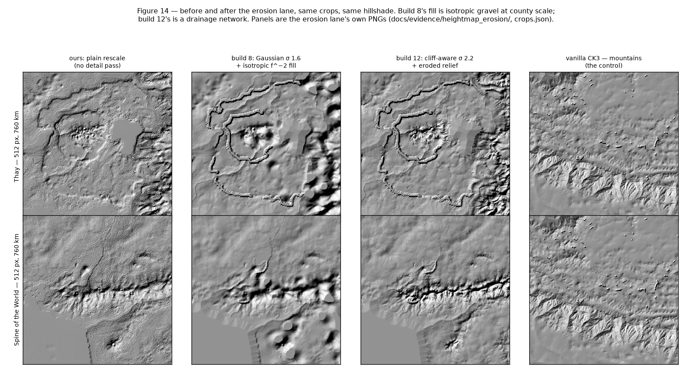

# Painting Faerûn: micro-scale similarity with vanilla, macro-scale fidelity to CK2

> **Revision 2026-09-10 — re-measured on build 12.** The first edition measured
> a build-8 conversion (`../_out/seafloor`). Builds 9–12 changed three of the
> passes this report is about, so every figure and every number below is now
> measured on the **live generated mod** (build 12, converter `main` c9bc250):
> the de-terrace Gaussian became a cliff-aware Perona–Malik diffusion and the
> isotropic `f^−2.0` fill became an erosion-shaped fill against vanilla's own
> measured spectrum (`docs/step_map_heightmap.md` §2b/§2c); gameplay terrain now
> follows the CK2 province-history override (`docs/step_map_terrain.md`); tree
> meshes are sampled from vanilla's measured regional mix
> (`docs/step_map_paint.md` §9.9). What moved, largest first: **land on the
> clamp floor 8.19 % → 0.35 %**; the interior spectrum at 0.1 cycles/km
> **0.37× → 1.13×** of vanilla; the Thay cliff kept by pass 1 alone
> **64–67 % → 96–110 %**; the 19–38 km band overshoot **1.68× → 1.05×**;
> land p99 **37,827 → 33,478**. What did not move at all: the terrain paint —
> `terrain_area_share.csv` and `paint_blend.csv` are byte-identical to the
> build-8 edition, because the paint is per-pixel from `terrain.bmp` and neither
> the erosion nor the province-history override touches it. The argument is
> unchanged; only the numbers and the status of §6's remainders are.
> The build-8 numbers are kept under
> `docs/evidence/report_map_paint/build8/`, and
> `uv run python scripts/report_map_paint_diff.py` prints the two side by side.

**Method in one paragraph.** The converter reads five CK2 bitmaps — `topology.bmp`,
`terrain.bmp`, `trees.bmp`, `rivers.bmp`, `provinces.bmp` — and writes the rasters
CK3's renderer actually samples: `map_data/heightmap.png` (through the packed
pair), `gfx/map/terrain/detail_index.tga` and `detail_intensity.tga`,
`gfx/map/terrain/colormap.dds`, and 18 tree-instance files under
`gfx/map/map_object_data/generated/`. Nothing is authored by hand and no map
editor is involved: every output is a pixel-wise function of a CK2 bitmap and a
table of numbers measured off the vanilla CK3 install. This report is about where
those two inputs meet.

## The two axes

Every decision in the paint pipeline answers one of two questions, and only one:

| | CK2 Faerûn supplies | vanilla CK3 supplies |
|---|---|---|
| what | **where** things are | **what a map looks like at 1 km** |
| examples | coastlines, mountain ranges, Anauroch, which pixels are forest, the profile of the Spine of the World | material palette, blend statistics, height spectrum, per-terrain detail amplitude, colour saturation, tree density |
| test | does the continent still have Faerûn's geography? | would this measurement pass for a vanilla screenshot? |

Call these **macro** and **micro**. They are not in tension in principle, but the
CK2 data is far too coarse to carry the micro axis on its own — Faerûn's source
elevation is 8-bit at 2.90 km per pixel — and vanilla's own rasters know nothing
about Faerûn. So each pass either preserves a CK2 macro fact or matches a measured
vanilla micro statistic, and the passes are ordered so a micro pass can never
overwrite a macro one.

The two axes meet at one number. `docs/map_scale.md` fits vanilla CK3's own scale
at **1.4839 km per pixel** (core-Europe latitude fit, R² 0.9962) and Faerûn's at
**2.90 km per pixel** (atlas scale bar), giving a scale factor of **1.9543** and a
canvas of **8320 × 6784**. Choosing to preserve Faerûn's real size is macro
conservation, but it is also what makes every micro measurement transferable: a
vanilla pixel and one of ours now cover the same ground, so sigmas, densities and
correlation lengths measured on vanilla can be used unconverted.

---

## 1. Elevation: rescale for macro, synthesise for micro

The rescale is a piecewise-linear transfer curve pinned at `0 → 0`,
`ck2_sea_level 95 → ck3_water_level 4883`, `255 → ck3_max_level 49205`,
LANCZOS-resized onto the canvas (`ck2ck3.map.heightmap`). It is exact macro
conservation and nothing else: our land percentiles match the CK2 source's to four
figures.

It is also unusable as a finished map. An 8-bit source through that curve leaves
160 usable land steps **277 sixteen-bit levels apart**, and Faerûn measures
**212 distinct height values** map-wide against vanilla's **31,516** (`verified`,
`docs/evidence/map_fidelity/heightmap_stats.csv`). The failure is not flatness —
the plain rescale's high-pass RMS, 319, is *higher* than vanilla's 283 — it is that
all of the extra energy is terrace risers rather than terrain.

`ck2ck3.map.heightmap_detail` fixes the micro axis in four passes: de-terrace
(**cliff-aware Perona–Malik diffusion**, σ-equivalent 2.2 canvas px, flux
half-width 415.5 levels, land only), a spectral fill whose phase comes from a
short **landscape-evolution model** and whose amplitude is the per-frequency
shortfall against **vanilla's own measured land spectrum**, river-valley
carving, coast smoothing. Two vanilla measurements drive it. The target is no
longer an extrapolated `f^−2.0` law: fitted over 0.02–0.4 cycles/km vanilla's
exponent is −2.195 and it flattens near its own Nyquist, so
`target_mode = "vanilla_curve"` imports vanilla's measured shape and anchors it
to our map on the 0.015–0.03 band where the two already agree
(`docs/step_map_heightmap.md` §2c). And the amplitude is not global: vanilla's
own high-frequency RMS runs from **70 levels for taiga to 323 for
desert_mountains**, a factor of 4.6, so the injected relief is scaled per pixel
by the terrain class the majority vote has already assigned.

*Figure 1 — the calibration table the detail pass obeys, and what it achieved.
Black is vanilla's own measurement (`hf_by_terrain.csv`); red and blue are the
shipped map. The ordering mountains ≫ hills ≫ plains ≫ taiga is reproduced.
This edition **measures** the achieved column instead of transcribing it, with
vanilla's own estimator transposed to our 1× heightmap (32 px windows, the
central half all one province terrain, high-pass σ 2.0 px). Eight of the ten
classes land within 0.76–1.23× of target; **mountains is 1.81×** (563 levels
against 311) and is the one real miss — the same 0.3 cycles/km residual §6
flags, concentrated where the cliffs are. All-land and interior now agree to
within 2 %, which is itself a result: in the build-8 edition the coast step
inflated the all-land column by up to 1.5×, and the erosion pass no longer
sinks lowlands onto the coast-adjacent clamp floor (§7.4).
`docs/evidence/report_map_paint/hf_achieved.csv`.*

*Figure 2 — the single best micro-similarity test. 256 × 256 all-land patches,
n = 48 per map, radially averaged, log-log. The CK2 source (purple) is an order of
magnitude short of vanilla everywhere above 0.02 cycles/km. The plain rescale
(blue) rises to meet vanilla near 0.1 c/km, but that rise is the quantisation
floor, not terrain. The shipped map (red) now **tracks vanilla to its own
Nyquist**: 1.08× at 0.05 c/km, 1.13× at 0.1, 0.98× at 0.15, 0.91× at 0.2.
This is the largest change in the report — the build-8 fill was 0.54/0.37/0.26/0.23×
at the same four frequencies. The one point that misses is 0.3 c/km at
**2.06×**, and it is not the fill: the plain rescale is already 1.50× there, so
it is the de-terraced base's own residual (§6). The thin red curve is the same
shipped array over the Sword Coast crop the prototype was tuned on; it contains a
coastline, whose 4884-level step flatters every frequency.
`docs/evidence/report_map_paint/spectrum.csv`.*

*Figure 3 — micro detail added without moving macro geography. Left: a 1400-level
window of the land-height histogram. The plain rescale is a comb with teeth 277
levels apart; the shipped map is continuous. Map-wide the distinct-value count goes
**212 → 44,366**, against vanilla's 31,516. Right: land-elevation percentiles. The
plain rescale sits exactly on the CK2 source (open circles) — the rescale invents
nothing. The detail pass now holds almost the whole distribution: p25 +0.7 %,
p50 9038 → 9091 (+0.6 %), p75 −1.6 %, **p95 −0.0 %** (23,166 → 23,158), with only
p99 (+6.4 %, 31,476 → 33,478) and the bottom two percentiles (p01 −7.4 %,
p05 −3.9 %, coast smoothing) moving at all. The build-8 fill moved p95 +9.4 %
and p99 +20.2 % and pulled p01/p05 flat onto the water level; bounding the
synthesised offset into each pixel's own headroom instead of clamping it
(`docs/step_map_heightmap.md` §2c(d)) is what fixed that.
`docs/evidence/report_map_paint/land_stats.csv`.*

Three invariants keep the micro pass off the macro one by construction rather than
by clamping: every water pixel is returned byte-identical to the plain rescale (the
land mask comes from the province raster, not a height threshold); every land pixel
ends strictly above the water level; and frequencies below 0.01 cycles/km are never
touched, so the CK2 source's real mountains and valleys survive. The second one is
now a `tanh` saturation into each pixel's own headroom rather than a closing clip,
which is why §7.4's clamp-floor defect is closed. The pass is deterministic
(`heightmap_detail_seed = 1357`) and costs **50 s** on the full canvas (10.9 s in
build 8; the whole `map` step goes 61 s → 103 s).

## 2. The sea floor: vanilla's shape, not CK2's noise

CK2 carries almost no bathymetry. Rescaled, Faerûn's entire ocean landed in
`[1439, 4883]` — a median only **39 % of the way below the water surface** — and CK3
paints shallow water as sand, so the Sea of Swords came out beach-coloured in the
in-game check (`docs/step_map_paint.md` §9.6).

There was no macro fact to preserve here: the CK2 sea floor is not Faerûn geography,
it is an artefact of a bitmap that only ever had to say "wet". So this pass is pure
micro imitation. Vanilla's own sea floor is a **flat 0** — p25, median and p75 of its
underwater pixels are all 0 (`verified` against `game/map_data/heightmap.png`).
`heightmap.deepen_sea` takes that shape: every water pixel to `sea_floor = 0`, with a
linear ramp over `sea_shelf_px = 24` px of distance from the nearest land, so beaches
and straits keep a gradient instead of dropping off a wall.

*Figure 4 — one canvas row west from Waterdeep into the Sea of Swords. Blue is the
CK2-derived floor — the plain rescale itself, which is what `deepen_sea` acts on —
sitting only 700–1900 levels below the surface; red is the shipped map, at
vanilla's 0, with the 24 px shelf visible as the ramp at each shore
and around the shoals near x ≈ 1930–2020. Map-wide the water median goes
**2981 → 0**, p25 2107 → 0 and p75 4420 → 0, with **14.6 %** of the 29,995,108
water pixels left on the shelf. Land is untouched, and this pass is the one
thing builds 9–12 did not change.
`docs/evidence/report_map_paint/seafloor_transect.csv`,
`water_stats.csv`.*

## 3. Terrain paint: CK2 picks the class, vanilla picks the texture

CK3 does not render terrain from the 120 mask PNGs its `materials.settings` names.
It reads `detail_index.tga` (four material ordinals per pixel, in declaration order)
and `detail_intensity.tga` (their weights, summing to exactly 255). `verified`, and
usefully so: 49.1 % of sampled non-zero channels in vanilla's own bake name a
material whose shipped mask is 0 at that pixel, so the masks are map-editor input,
and a converter that writes the pair directly never needs the editor.

The split is clean. **Macro**: each pixel's CK2 terrain category, through
`CK2_TO_CK3_TERRAIN`, gives a CK3 terrain key — including the `trees.bmp` promotion
to `forest`, without which Faerûn's forests would vanish, since its `terrain.bmp`
forest index has zero pixels. **Micro**: `mappings/terrain_paint.csv` maps each of
the 17 CK3 keys to a (primary, secondary) pair of **existing vanilla materials**, so
colour and tiling match vanilla by construction and no `.dds` is authored. Vanilla's
class edges are dithered where CK2's palette edges are hard, so the
primary/secondary blend weight is a Gaussian-filtered noise field (σ = 1.5 px,
seed 11, 16 quantisation steps).

The material table was audited against vanilla's own bake
(`scripts/verify_terrain_paint_materials.py`, which reads what material vanilla
itself paints for each terrain key). It found one real bug — `forest` was painted
with `forest_pine_01`, byte-identical to `taiga`'s primary, giving broadleaf forest
a conifer texture, where vanilla's own pick is `forest_leaf_01` at 75.5 % share —
and resolved two flagged judgement calls against data (`terraced_hills` →
`farm_paddy_01`, 56.5 % share; `desert_mountains` swapped to lead with
`desert_rocky`, 36.9 %).

*Figure 5 — read back out of the shipped `detail_index.tga`, land only. Our
composition is CK2's, not vanilla's, and deliberately so: plains 21.4 %,
hills 15.7 %, steppe 13.9 %, taiga 13.7 %, mountains 13.4 %, desert 9.0 %,
forest 6.7 %, jungle 4.0 %, wetlands 1.5 %, farmlands 0.8 %, against vanilla's
68.3 % plains. The one large gap between the purple
and red bars is `forest`, which comes from `trees.bmp` rather than `terrain.bmp`.
This is what macro conservation looks like when it works: the micro machinery is
entirely vanilla's, and none of it dragged vanilla's geography along with it.
**Unchanged from build 8 to build 12, to the pixel.** Build 10 moved 946
provinces onto the CK2 author's `terrain = X` override — farmlands 16 → 335
provinces — but that is *gameplay* terrain, and by design the paint stays
per-pixel and does not follow it (`docs/step_map_terrain.md`, CLAUDE.md
invariant), so every count in `terrain_area_share.csv` is identical to the
first edition's.
`docs/evidence/report_map_paint/terrain_area_share.csv`.*

Format was settled by reading vanilla and two shipped total conversions rather than
by guessing: vanilla's pair is TGA image type 2 (uncompressed), Elder Kings 2 and
Godherja both ship type 10 (RLE) at full resolution, and `ck3.exe` names
`detail_index.tga` exactly twice, both times next to a literal `.tga`, so DDS is not
worth the risk. At full resolution the pair is 452 MB and `detail_intensity` cannot
clear GitHub's 100 MB cap in any container — the noise field is the cost, not the
format — so the shipped setting is `tga_rle` at `terrain_paint_scale = 0.5`:
**2.33 MB + 54.55 MB**, loaded in game with no texture error.

## 4. Colour: a measured tint, after a resample that was the wrong idea

The first attempt resampled CK2's own `map/terrain/colormap.dds` onto the canvas.
The in-game check killed it: the ground went pale blue-white and the ocean brown.
The cause is a category error worth recording. Vanilla's `colormap.dds` is a
near-neutral **tint** multiplied over the material textures (131,129,131 over ocean,
148,125,106 over France); CK2's is a saturated **satellite image** of CK2's own
world with no sea/land distinction, and its arctic patch landed on Waterdeep.
Resampling a macro asset does not produce a micro-correct one.

The replacement is a measurement.
`scripts/measure_vanilla_colormap_tints.py` pairs every pixel of vanilla's
`colormap.dds` with the same pixel of its `detail_index.tga` and accumulates a mean
RGB per material over land — 102 rows, every mean inside a tight near-neutral band
(R 115–154, G 114–142, B 96–140). `mappings/colormap_tints.csv` then looks up each
CK3 terrain key's **primary material in the table we already have** and takes that
material's measured mean, so there is no second hand-picked table. Water pixels get
vanilla's own measured sea/lake tint. The blur is measured too: the radially
averaged autocorrelation of a high-passed, guaranteed-all-land crop of vanilla's
colormap first drops to 1/e at **9 px**, used unconverted because our canvas is
built to vanilla's km/px.

*Figure 6 — left, the per-terrain tints, each bar drawn in its own literal colour;
they look grey because vanilla's are grey. Right, the autocorrelation curve the blur
sigma comes from. On the shipped map, land saturation (max − min channel) is
**4.18** against vanilla's weighted land mean of **6.97**, and water **1.02**
against vanilla's **0.85** — under vanilla on land, within a point on water.
`mappings/colormap_tints.csv`, `docs/evidence/vanilla_colormap_blur.csv`,
`docs/step_map_paint.md` §9.7.*

## 5. Trees: CK2's mask, vanilla's density, vanilla's regional mix

CK3 has no tree bitmap; trees are placed instances. Vanilla places **549,126** of
them over its 9216 × 4608 canvas — 0.012931 per pixel — which at the same visual
density is a target of **729,838** for ours. Eligibility is macro (any non-zero
`trees.bmp` pixel, upsampled 8× and resampled onto the canvas, minus water and
impassable); density is micro (vanilla's own figure); mesh choice is neither CK2's
palette nor a guess, and since build 11 it is not the pixel's terrain class alone
either: it samples vanilla's own measured
**`P(mesh | terrain, climate, latitude band)`** (`mappings/tree_mix.csv`), because
no CK2 index → species mapping was ever confirmed. On the live build-12 mod,
**700,622 of 729,838 placed (96.0 %)**; the 29,216 dropped are on desert,
mountains and farmlands, which have no mesh row by design.

*Figure 7 — instances per generator file. The regional mix uses **17 of vanilla's
18** generators, against the 6 the build-8 terrain-class rule used, and the largest
single generator falls from **47.7 % to 26.2 %** of all instances
(`tree_leaf_high_generator_1`). `tree_leaf_01_single` collapses 179,733 → 6,755
and `tree_pine_01_b` rises 46,370 → 119,643, which is the Spine of the World
turning coniferous. Our total is 28 % above vanilla's 549,126 because our canvas is
33 % larger; the per-pixel density is still vanilla's own.
`docs/evidence/report_map_paint/tree_counts.csv`.*

By latitude band the mix is now vanilla-shaped rather than uniform: pine's share of
the two northernmost bands goes **14.3 % → 72.1 %** against vanilla's own 92.6 %,
and jungle + palm in the two southernmost **52.3 % → 75.4 %** against 63.8 %
(`docs/evidence/tree_mix/lat_band_mesh.csv`, method in `docs/step_map_paint.md`
§9.9). One discrepancy is worth recording rather than smoothing over: §9.9
reports **711,875** instances for the regional mix and the lane's own output
directory (`../_out/trees-regional`) still holds exactly that, but the live
build-12 mod holds **700,622** — 11,253 fewer, with the mix itself also shifted
(`tree_jungle_01_d` 102,756 → 159,334, `tree_pine_01_a` 41,695 → 24,951).
This report measures the live mod; why the two runs differ is open.

## 6. What is still not vanilla-like

Three of the five remainders the first edition listed are **closed** by builds
9–12; the other two, and two new ones, are open. Every number below is a column
of a CSV in `docs/evidence/report_map_paint/`.

**Closed — the band above 0.08 cycles/km is filled.** The first edition measured
80 levels at 0.1 cycles/km against vanilla's 215, and 10 against 45 at 0.2 —
less, there, than even the plain rescale managed. Measured the same way on the
same 48 all-land interior patches, build 12 carries **243 against vanilla's 215
at 0.1 c/km and 41 against 45 at 0.2** (1.13× and 0.91×), and 1.08× at 0.05.
Two changes did it: the target is vanilla's own measured curve rather than an
`f^−2.0` extrapolation, and the shortfall is now measured on interior patches
rather than on a whole-canvas FFT that coastlines dominate
(`docs/step_map_heightmap.md` §2c(a)/(b), `spectrum.csv`).

**Closed — the clamp floor.** 8.19 % of land sat dead flat at `water_level + 1`;
it is now **0.35 %** (92,531 px), and those pixels are no longer sunk lowlands:
their median distance to water is **1 px**, 99.3 % are within 6 px of a shore,
and the plain rescale's own value there averages *below* the floor. In other
words what is left is coast smoothing doing its job, which is what §1 wrongly
claimed the first edition's floor was. `clamp_floor.csv`, and §7.4.

**Closed — isotropic noise.** The fill's phase now comes from a short
landscape-evolution model (multiple-flow accumulation, stream-power incision,
uplift, hillslope diffusion) and the deficit is imposed on it as a radial
equaliser, which changes no phase — so the valleys and ridges survive the
amplitude match. The 19–38 km overshoot §7.1 called "gravel at county scale"
falls **1.68× → 1.05×** of vanilla's most rugged coast (`thay_bands.csv`), and
the rivers agree with the drainage rather than fighting it: 90.5 % of traced
river pixels sit below their own 9 km surroundings
(`docs/evidence/heightmap_erosion/river_alignment.csv`). Figure 14 is the look.

**Still open — half of vanilla's spatial bandwidth, by construction.** We ship a
1× heightmap, so our Nyquist is 0.337 cycles/km against vanilla's 0.674
(`verified`). No detail pass can reach past it. `resolution_factor = 2` is a
one-line change and a large one in bytes.

**Still open — the 0.3 cycles/km residual.** At 3.3 km — 2.2 canvas pixels — we
carry **2.06×** vanilla's amplitude. This is not the fill: the plain rescale is
already 1.50× there and the computed deficit at that frequency is zero. It is
the de-terraced base's own residual, i.e. the very cliffs §2b deliberately keeps,
and cutting it means giving them back (`spectrum.csv`,
`docs/step_map_heightmap.md` §2c). Its visible face is figure 1's one miss:
**mountains at 1.81× of vanilla's per-class amplitude** (563 levels against 311),
where every other class is inside 0.76–1.23× (`hf_achieved.csv`).

**Still open — `assumed`, not `verified`.** Equating an autocorrelation
e-folding radius with a Gaussian sigma is exact only for blurred white noise, and
one 1024 × 1024 sample region stands in for the whole vanilla map, so blur
σ = 9 px is `assumed`. So is the visual quality of half-resolution terrain paint
at close zoom: it loads without error and reads correctly at the zoom the camera
probe reaches, but nobody has looked at it from ground level. And the erosion
adds one of its own — Perona–Malik sharpens the edges it decides not to cross, so
the finished map's largest single-pixel step in Thay is **20.2 risers against the
plain rescale's own 14.0** (`thay_steps.csv`). Whether a crisper escarpment reads
as cliff or as drawn-on contour is a look call at close zoom, not a measurement.

**Still open — unreviewed.** 758 counties took a CK2 `positions.txt` port-slot
seed for their coastal city holding, moving barony borders relative to the
previous farthest-point sampling. Nobody has reviewed those duchy sheets, and in
the original study 28.4 % of proposed seeds landed in a different barony than the
one they are assigned to today.

**Still open — the paint, entirely.** Nothing in builds 9–12 touched it. Our
terrain paint is still a strict two-material blend against vanilla's 3.47
(§7.3), and we still paint no shoreline material on land at all. Both are
unchanged measurements, not stale ones: `paint_blend.csv` and
`material_share.csv` are byte-identical to the first edition's.

---

## 7. Side by side

Three questions, asked after the first six sections were read: what happens to
Thay's terraces, how does the map look next to vanilla at matched zoom, and
which of the paint differences are *supposed* to be there. Every number below
is in a CSV under `docs/evidence/report_map_paint/` and every figure is
reproduced by the same one command.

### 7.1 Thay's terraces: the de-terrace pass now keeps the cliff outright

Thay is the hard case on purpose. It is a stack of sharp terraces behind deep
escarpments, and the pipeline's very first micro pass exists to destroy
terraces — so if anything in the map is going to lose a real cliff, it is this.
The window is derived from the data rather than picked by eye: the **33
counties** under `k_thay` in
`Faerun/Faerun/common/landed_titles/01_landed_titles.txt` cover 47,652 CK2
pixels, bounding box CK2 (2351, 738)–(2636, 1064), which is canvas
4711–5348 × 1542–2259, **945 km across**
(`docs/evidence/report_map_paint/thay_counties.csv`, one row per county). This
section asked the question of a Gaussian σ = 1.6 px and answered "it costs
sharpness, not amplitude"; build 9 replaced that filter with a cliff-aware
Perona–Malik diffusion at σ-equivalent 2.2 px, and the same measurements are
repeated below on it.

*Figure 8 — the same ground four times: the CK2 source at its own 2.90 km/px,
our plain rescale, the de-terrace pass alone, and the shipped map. Row 2 is
the red box, the steepest escarpment in the window. The terraces are plainly
visible in columns 1 and 2 and plainly gone in column 3 — and so is the CK2
source's own pixel grid, which is the point. What column 4 adds is not the
terracing back.*

**The measurement.** On the plain rescale every land pixel is an exact multiple
of one **riser** — 277.0125 levels, one 8-bit source step — above the water pin,
so a step between neighbours is countable in risers. Over the 757,403
land-to-land pixel edges in the window
(`docs/evidence/report_map_paint/thay_steps.csv`, `verified`; the build-8
column is `build8/thay_steps.csv`):

| step across one pixel | plain rescale | after de-terrace (b8 Gaussian) | after de-terrace (**b12 Perona–Malik**) | shipped (**b12**) |
|---|---|---|---|---|
| flat (0) | **48.45 %** | 3.15 % | 3.21 % | 1.44 % |
| under one riser | 0.05 % | 57.48 % | **71.24 %** | 50.26 % |
| exactly 1 riser — pure quantisation | **34.15 %** | 28.01 % | **14.25 %** | 26.45 % |
| 2 risers | 11.02 % | 7.99 % | 2.49 % | 9.43 % |
| 3–4 risers | 5.50 % | 3.18 % | 6.31 % | 8.28 % |
| ≥ 5 risers | 0.84 % | 0.19 % | **2.50 %** | 4.14 % |
| largest single step | 13.999 risers (3878 levels) | 9.42 | **14.19** | 20.16 |

Read the plain-rescale column and the pass's job is clear. Half of its edges are
*flat* and a third are *exactly one riser*: that pair is the staircase, and it is
82.6 % of all edges. Both filters turn the staircase into a ramp, but they part
company on what they do with the rest. The Gaussian pushed sub-riser edges to
57.5 % and flattened the multi-riser edges with them (≥ 5 risers 0.84 % → 0.19 %).
The cliff-aware pass reaches **71.2 %** sub-riser — half again as much of the
artefact removed, quantisation edges 34.15 % → 14.25 % — while the ≥ 5-riser
edges go *up*, 0.84 % → 2.50 %, and the largest single step survives at 14.19
risers against the source's own 13.999.

But a per-pixel step is the wrong instrument for "did the cliff survive". So the
right measurement is the **signed drop across a growing baseline**, taken on the
edges the plain rescale itself calls cliffs, oriented by the plain rescale's own
sign so that zero-mean synthesis noise averages out instead of inflating the
answer (`thay_cliffs.csv`; pass 1 in isolation, both filters against the same
plain rescale):

| baseline | ≥ 2 risers (n = 56,257) | ≥ 4 risers (n = 6,224) | ≥ 6 risers (n = 700) |
|---|---|---|---|
| 1.48 km (±1 px) | 64.3 % → **96.1 %** | 67.3 % → **110.5 %** | 64.2 % → **102.2 %** |
| 4.45 km | 78.5 % → 95.0 % | 76.6 % → 101.0 % | 71.9 % → 101.1 % |
| 10.4 km | 91.3 % → 98.3 % | 88.1 % → 99.2 % | 84.3 % → 99.3 % |
| 22.3 km | 96.2 % → 98.9 % | 96.2 % → 99.2 % | 97.4 % → 99.1 % |
| 34.1 km | 98.4 % → 99.6 % | 98.4 % → 99.6 % | 98.0 % → 99.4 % |

*(build 8 → build 12, `verified`.)*

**The answer, `verified`, has changed.** The first edition's was "σ = 1.6 px does
not flatten real cliffs, but it costs a third of the one-pixel step". Build 12's
is stronger: the cliff-aware pass keeps **96–110 % of the drop at every baseline
including one pixel**, while removing half again as much of the quantisation
riser. Values slightly over 100 % are real and expected — Perona–Malik sharpens
an edge it decides not to cross — and the converter's tests bound that at 1.25×
so a future sigma change cannot turn it into a cartoon
(`docs/step_map_heightmap.md` §2b). The remaining honest caveat is the look, not
the amplitude: a 10 % crisper escarpment at 1.48 km is a human's call at close
zoom (§6).

The same CSV's `kept_shipped_pct` column falls (57 % at 1.48 km on the ≥ 2-riser
class, against build 8's 58 %, and 41 % against 62 % on ≥ 4 risers). That column
is the weaker measurement and is only here for continuity: the synthesised
relief lands on the very pixel pairs the metric reads, so a *larger* fill lowers
apparent survival whatever pass 1 did — and build 12's fill is three times
build 8's at 0.1 cycles/km. The isolated columns above are what this section
claims.

*Figure 9 — two rows straight across the plateau. The insets are the two cases
side by side: left, the steepest pixel step on the row — blue falls, green
falls the same distance in the same place; right, the flattest land window on
the same row, where blue is a clean 277-level staircase and green is the smooth
ramp through it. Same filter, opposite verdicts. Blue bands are water-province
pixels.*

**Where the fill lands now.** Band-passing the same ground against vanilla's own
most rugged coast (`thay_bands.csv`, `verified`; the shipped column is build 12,
the parenthesised one build 8):

| wavelength | plain rescale | de-terraced | **shipped (b12)** | shipped (b8) | **vanilla, Norway** |
|---|---|---|---|---|---|
| 2.4–4.7 km | 141 | 131 | **221** (1.14×) | 167 (0.86×) | 194 |
| 4.7–9.5 km | 294 | 283 | **487** (1.36×) | 409 (1.14×) | 359 |
| 9.5–19 km | 528 | 517 | **845** (1.31×) | 925 (1.43×) | 646 |
| 19–38 km | 812 | 807 | **1091** (1.05×) | 1745 (1.68×) | 1038 |
| 38–76 km | 1213 | 1211 | **1274** (0.91×) | 1689 (1.20×) | 1404 |

The county-scale overshoot this section was written to diagnose is gone: 19–38 km
falls **1.68× → 1.05×** and 38–76 km **1.20× → 0.91×**. The excess that is left
sits at 4.7–9.5 km, at **1.36×**, and it is a third of what the old fill carried
two bands higher. Below 5 km we are now slightly *over* vanilla (1.14×) where the
first edition was under (0.86×) — the same 0.3 cycles/km residual §6 leaves open.

*Figure 10 — the three tables above as one figure.
`thay_steps.csv`, `thay_cliffs.csv`, `thay_bands.csv`.*

*Figure 14 — the same two crops through build 8 and build 12, next to a vanilla
mountain control. Left, the plain rescale; middle-left, build 8's Gaussian plus
isotropic `f^−2.0` fill; middle-right, build 12's cliff-aware de-terrace plus
eroded relief; right, vanilla. Build 8's surface is the "gravel" §6 described —
amplitude in roughly the right band, no drainage. Build 12's has valleys that
join and ridges that run, which is what the band-pass table above is measuring
indirectly. This is a look call and the panels, not the metrics, are the
evidence: two of the three structure metrics the erosion lane tried do not
separate isotropic noise from landscape (`docs/step_map_heightmap.md` §7). The
panels are the erosion lane's own PNGs at its own two crops,
`docs/evidence/heightmap_erosion/hillshade_*.png` and `crops.json` — Thay and
the Spine of the World, 512 canvas px (760 km) each.*

### 7.2 Three zooms, three maps

Same kilometres in every panel, so the eye is comparing terrain and not
resolution. Columns: the CK2 source rescaled and nothing else, the shipped map,
and a vanilla CK3 crop of the Norwegian coast — chosen because it is coast plus
mountains in one frame, the closest vanilla has to both the Sword Coast and
Thay. Centres and extents are in
`docs/evidence/report_map_paint/panel_extents.csv`. Hillshading is done in
**game units** (`level / 65535 × WORLD_EXTENTS_Y` over provinces-pixels of
ground), which is the only like-for-like: it compares the slope the renderer
sees, not how many pixels each map spends on a kilometre.

*Figure 11 — elevation, build 12. Three things read immediately, and the first
two are new. At **continent** scale the 20–40 km blobs the first edition saw
are gone: the middle column now carries ridge lines and river-shaped lowlands
of its own, which is the 19–38 km overshoot falling 1.68× → 1.05× (§7.1),
visible. At **region** scale we are dendritic where the build-8 panel was
smooth lumps — still coarser than vanilla, but the same kind of surface — and
the pink clamp-floor pixels have shrunk from patches inland to a one-pixel
coastal fringe (0.35 % of land, §7.4). At **local** scale (80 km) the verdict
is unchanged and structural: the CK2 column shows its terrace banding, ours is
a blur, and vanilla has real ridges, because our 1× heightmap spends 52 px
there against vanilla's 106 (§6).*

*Figure 12 — the same three extents in terrain paint. Each pixel is drawn as
its `detail_index` materials' own vanilla-measured colormap tints, blended by
`detail_intensity` and pushed ×7 away from grey, because vanilla's tints are
near-neutral by design (§4) and a literal rendering is a hundred shades of
grey. The gain is display only and identical in all three columns. Ours is
speckled where vanilla is coherent: our primary/secondary blend is a σ = 1.5 px
noise field on a 2.97 km/px sheet, so its dither is a 4–5 km checker, while
vanilla's blends follow relief. Our paint is also half vanilla's resolution in
km per pixel (`terrain_paint_scale = 0.5`, §3), which the local row shows as
26 px against 52.*

### 7.3 Paint composition per material, and which differences are expected

Figure 5 compared terrain *keys*. Below the keys are the 102 materials vanilla
actually declares, and that is where the interesting difference lives. Shares
are **intensity-weighted** — a material's real fractional coverage summed over
all four `detail_index` channels, not just where it happens to be the primary —
over land only, both maps
(`docs/evidence/report_map_paint/material_share.csv`, one row per material).
**Every number in this subsection is unchanged from the first edition**, and
that is a result rather than staleness: builds 9–12 changed the heightmap, the
gameplay terrain and the tree meshes, and touched the paint not at all.
`material_share.csv` and `paint_blend.csv` re-measured on build 12 are
byte-identical to `build8/`'s.

*Figure 13 — left, the 22 largest materials. Right, the same numbers rolled up
into families with the difference and a verdict on it.*

| family | ours | vanilla | difference | expected? |
|---|---|---|---|---|
| desert & drylands | 8.97 % | 21.88 % | **−12.91 pp** | **geography.** Vanilla's land is the Sahara, Arabia, Iran and the Thar; Faerûn's only true desert is Anauroch, with the Calim and Raurin fringes. A lower arid share is the correct answer. |
| mountain | 13.41 % | 22.52 % | −9.11 pp | mixed. Vanilla carries the Alps, Caucasus, Zagros, Himalaya and Tibet — but we also fold CK2 `impassable_mountains` and `subterranean` into the one key, so the gap is not purely geographic. |
| forest & jungle | 20.46 % | 12.31 % | +8.15 pp | geography. Faerûn is forested (High Forest, Cormanthor, the Chondalwood) and `trees.bmp` promotes every wooded pixel; vanilla's sheet is cleared or arid. |
| plains & lowlands | 21.63 % | 14.09 % | +7.54 pp | mixed. Part real (the Dalelands, the Vilhon Reach), part fall-through: CK2 `pti` filler and unmapped indices both land on plains. |
| steppe | 13.86 % | 6.68 % | +7.18 pp | geography. The Shaar, the Eastern Shaar and the Endless Wastes against vanilla's Pontic steppe. |
| hills | 15.65 % | 9.81 % | +5.85 pp | mixed. Faerûn's CK2 palette has one hills index and spends it freely; vanilla splits the same ground with its regional families. |
| snow & ice | 3.95 % | 4.54 % | −0.59 pp | geography. CK2 `arctic` and `glacier` both fold to taiga, whose secondary is `snow`. |
| wetlands | 1.48 % | 2.02 % | −0.53 pp | geography. Small on both maps. |
| farmland | 0.58 % | 0.60 % | −0.02 pp | geography — both maps paint about the same. |
| **beach & cliff** | **0.00 %** | 1.26 % | −1.26 pp | **not geography — a mapping gap.** Faerûn has more coastline per unit area than vanilla, and we paint no shoreline material on land at all: `mappings/terrain_paint.csv` gives `sea`/`coastal_sea` a beach material, but those pixels are under water and no land key ever picks one. |
| other | 0.00 % | 4.28 % | −4.28 pp | mapping. Vanilla's leftovers are regional and rock materials our table never selects from. |

Two mapping facts sit under the whole table. We paint **20 of vanilla's 101**
used materials, and **56.1 % of vanilla's own coverage is regional or
climate-zone families** (`gen_*`, `medi_*`, `northern_*`, `india_*`,
`central_*`) that `mappings/terrain_paint.csv` excludes on purpose, because a
material named for a real-world region has no Faerûn meaning. That exclusion is
defensible and it is also the single largest reason the two palettes do not
line up; it is a choice, not a measurement.

**The better measure is density, not area.** Area share mostly restates
geography. What actually separates the two bakes is how the four channels are
used (`docs/evidence/report_map_paint/paint_blend.csv`, `verified`):

| | ours | vanilla |
|---|---|---|
| materials used over land | 20 | 101 |
| non-zero channels per pixel | **2.000** | **3.467** |
| blend entropy | 0.73 bits | 1.49 bits |
| mean weight of the primary material | 0.71 | 0.52 |

Ours is exactly 2.000 — every land pixel is a strict primary/secondary pair,
by construction — against vanilla's 3.47, and vanilla's primary carries barely
half the weight where ours carries 0.71. This is the micro difference that no
area share can show, and it is a cheap one to close: a third material drawn
from the terrain classes of the neighbouring pixels, at low weight, would move
both numbers most of the way without touching the class map at all.

### 7.4 Two defects this section found, and what became of them

**The clamp floor: found at 8.2 % of land, now 0.35 %.** `heightmap_detail`
guarantees that every land pixel ends strictly above the water level. In build 8
it enforced that by clamping, and map-wide **2,166,924 land pixels — 8.19 % of
all land — sat at exactly `water_level + 1 = 4884`**: the synthesis had pushed
them under and the invariant pulled them back, throwing away a median of 7376
levels, p90 12,362, a mean of **3485 levels destroyed per pixel**. That was not
coast smoothing — the median such pixel was **76 px (113 km) from the nearest
water** — it was the spectral fill's amplitude sinking whole lowlands.

The fix was to bound the synthesised offset into the headroom each pixel
actually has (`tanh(|δ| / room) · room`, downward against `water_level + 1`)
before any clip runs, rather than to clip afterwards — a clamp is not a bound
(`docs/step_map_heightmap.md` §2c(d)). Re-measured on build 12: **92,531 pixels,
0.35 % of land**, median distance to water **1 px**, **99.3 % within 6 px of a
shore**, and the plain rescale's own value at those pixels averages 14 levels
*below* the floor — i.e. what remains is coast smoothing, doing its job on
pixels that were near the water line to begin with. So §1's original note that
"p01/p05 are pulled down to the water level by coast smoothing" was wrong about
the cause in build 8 and is right about build 12.
`docs/evidence/report_map_paint/clamp_floor.csv` and `build8/clamp_floor.csv`;
the pink fringe in figure 11's middle column is what is left.

**Figure 5 was a different PNG on every run.** Its key ordering broke ties
through set iteration, which `PYTHONHASHSEED` randomises. Fixed by making the
material name the tiebreak. Still fixed: figures 5, 6 and 7's ordering is
stable across the build-8 and build-12 runs.

---

Reproduce all fourteen figures: `uv run --with matplotlib python
scripts/report_map_paint_plots.py` (add `--recompute` to re-measure from the
rasters instead of the cached CSVs in `docs/evidence/report_map_paint/`). The
reference conversion every measurement reads is `--mod DIR`, defaulting to the
**live generated mod** `../claudespace/mods/faerun_ck2_to_ck3_converted`
(build 12). The first edition pinned `../_out/seafloor` instead, a build-8 run,
on the reasoning that the live mod is regenerated by whatever lane is running;
that turned out to cost more than it saved, because the report then described a
map nobody was playing. Point `--mod` at an `_out` directory to measure a
specific build; the build-8 measurements are kept under
`docs/evidence/report_map_paint/build8/` and
`uv run python scripts/report_map_paint_diff.py` prints the two editions side by
side.

Every number quoted above is a column of a CSV in that folder:
`thay_counties.csv` `thay_steps.csv` `thay_cliffs.csv` `thay_transects.csv`
`thay_bands.csv` `clamp_floor.csv` `panel_extents.csv` `material_share.csv`
`paint_blend.csv`, plus §1–§6's `spectrum.csv` `height_hist.csv` `land_stats.csv`
`seafloor_transect.csv` `water_stats.csv` `terrain_area_share.csv`
`tree_counts.csv` `hf_achieved.csv`. Figure 14 reuses the erosion lane's own
hillshades, `docs/evidence/heightmap_erosion/`.
Sources:
`docs/step_map_paint.md`, `docs/step_map_heightmap.md` (§2b, §2c),
`docs/step_map_terrain.md`, `docs/evidence/HANDOFF_erosion.md`,
`docs/map_fidelity.md`, `docs/map_scale.md`. In-game screenshots of the shipped
paint: `../claudespace/docs/evidence/waterdeep_terrain.png`, `waterdeep_sea.png`,
`anauroch.png`; of build 12's relief: `b12_thay_relief.png`,
`b12_spine_relief.png`.
